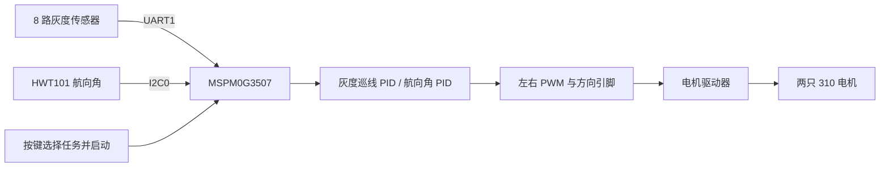

# 2024 电赛 H 题：MSPM0 自动行驶小车

这是一个围绕 [2024 年全国大学生电子设计竞赛赛区赛 H 题“自动行驶小车”](https://res.nuedc-training.com.cn/topic/2024/topic_116.html)整理的嵌入式工程。**2024 H 题的题名是“自动行驶小车”，不是“拼图装置”。**仓库以提供的 `2402_H6` 工程实际代码为准，公开小车的巡线、航向控制和双电机驱动实现。

主控为 **TI MSPM0G3507**，航向数据来自**维特 HWT101**，驱动轮使用用户所述的**310 编码器电机**。代码用 8 路灰度传感器识别赛道，用 PWM 对左右电机差速控制。`.syscfg` 虽配置了一组 QEI 编码器引脚，当前程序**没有读取编码器计数，也没有实现轮速闭环**；电机上的编码器不能被误写成已用的反馈环节。

## 工作流程



定时器每 10 ms 进入一次控制中断。程序根据任务模式和 `line_exist` 状态选择灰度巡线或航向保持，再给左右电机叠加相反的速度修正。详细公式、状态切换及当前代码的限制见 [算法具体实现](docs/algorithm.md)。

## 当前实现与赛题要求

| 内容 | 仓库中的实现情况 |
| --- | --- |
| MSPM0 控制轮式小车 | 使用 MSPM0G3507，左右 PWM 和方向引脚驱动两路电机 |
| 黑线行驶与路径切换 | 使用 8 路灰度数据、PID、`line_exist` 状态和边沿计数 |
| 航向辅助 | HWT101 通过 I²C 读取偏航角，航向 PID 控制差速 |
| A→B、指定一圈和四圈任务 | 提供四种任务状态与不同的计数停止条件，但没有实测轨迹、时间或顶点定位数据 |
| 编码器速度反馈 | `.syscfg` 配置 QEI 引脚，控制代码未读取 QEI 计数；目前是 PWM 开环驱动 |
| 经过顶点的声光提示 | PA9 配为声音输出相关 GPIO，但主动提示逻辑尚未实现；公开版本移除了许可不明的 OLED 显示代码 |

这份工程可作为**小车控制思路与代码样例**。赛题对路线、时间、声光提示、尺寸及禁止倒车等有具体要求；仓库没有这些项目的完整测试记录，不能据此宣称通过整题验收。

## 仓库内容

| 路径 | 用途 |
| --- | --- |
| [`24_H.syscfg`](24_H.syscfg) | MSPM0G3507 引脚、UART、I²C、PWM、QEI 和 10 ms 定时器配置 |
| [`24_H.c`](24_H.c) | 初始化、按键任务状态机、定时中断和停止条件 |
| [`comm1/hwt101.c`](comm1/hwt101.c) | HWT101 I²C 读取及原始角度换算 |
| [`comm2/comm2.c`](comm2/comm2.c) | 8 路灰度串口报文、权重误差和目标航向选择 |
| [`pid/pid.c`](pid/pid.c) | 巡线与航向 PID、左右差速 |
| [`motor/motor.c`](motor/motor.c) | 左右 PWM 限幅及方向输出 |
| [`Drivers/MSPM0/`](Drivers/MSPM0/) | SysTick 延时和中断辅助代码 |
| [`scripts/build.ps1`](scripts/build.ps1) | Windows 下生成 SysConfig 并编译链接的脚本 |
| [`docs/hardware.md`](docs/hardware.md) | 引脚、接线、电源及分步联调 |
| [`docs/protocol.md`](docs/protocol.md) | 灰度串口和 HWT101 数据读取说明 |
| [`docs/algorithm.md`](docs/algorithm.md) | 从传感器数据到电机指令的具体计算 |

`.ccsproject`、`.cproject`、`.project` 和 `targetConfigs/MSPM0G3507.ccxml` 可用于导入 CCS；`Debug/`、生成的配置、目标文件和本机缓存不提交。

## 编译与运行

1. 安装 **Code Composer Studio / CCS Theia**、**MSPM0 SDK 2.10.00.04**、**SysConfig 1.26.2** 和 **TI Arm Clang 4.0.4.LTS**。原工程 `.syscfg` 与 `.cproject` 记录了这些版本；不同版本若生成不同宏名，应先核对生成结果。
2. 在 CCS 中导入此文件夹作为已有工程，打开 `24_H.syscfg`，生成配置并构建。工程目标器件为 `MSPM0G3507`、`LQFP-64(PM)`；`ccxml` 使用 J-Link，请按实际仿真器核对后再下载。
3. Windows 上也可在仓库根目录运行：

   ```powershell
   .\scripts\build.ps1 -CcsRoot 'D:\TI\CCS' -SdkRoot 'D:\TI\CCS\mspm0_sdk_2_10_00_04'
   ```

   输出位于 `build/Debug/nuedc_2024_h_mspm0_car.out`。脚本只生成和编译，不自动烧录。SysConfig 关于 PWM、QEI、TIMER 在低功耗模式下寄存器不保持的提示属于原配置的提示信息。
4. 上电联调前先阅读 [硬件与联调](docs/hardware.md)。断开电机负载先检查按键、灰度报文与航向角，再低占空比测试两侧转向。

本仓库公开整理版已完成 SysConfig 生成、TI Arm Clang 编译和链接；**没有对实车重新烧录或完成赛题场地测试**。

## 公开整理时的改动

原工程使用的 OLED 字库/显示驱动来源许可不明，因此公开版本删除了 OLED 调用与依赖，并把原本由 OLED 模块提供的延时调用改为工程已有的 `mspm0_delay_ms()`。没有参与构建的 InvenSense MPU6050 示例也未纳入。灰度串口接收处补了缓存边界与最短帧检查，防止短帧读取旧数据或长帧写出缓冲区。电机 PWM 计数器启动前先将左右比较值设为 0，避免使用 SysConfig 初始的 500 计数值。其余巡线、航向和电机控制参数按所给工程保留。详见 [第三方代码与整理说明](THIRD_PARTY_NOTICES.md)。

## 许可

除文件内另有许可声明的 TI 模板部分外，本仓库应用代码、文档和构建脚本按 [MIT License](LICENSE) 开源。使用 TI SDK 组件时遵守其原始许可；详见 [第三方代码与整理说明](THIRD_PARTY_NOTICES.md)。
